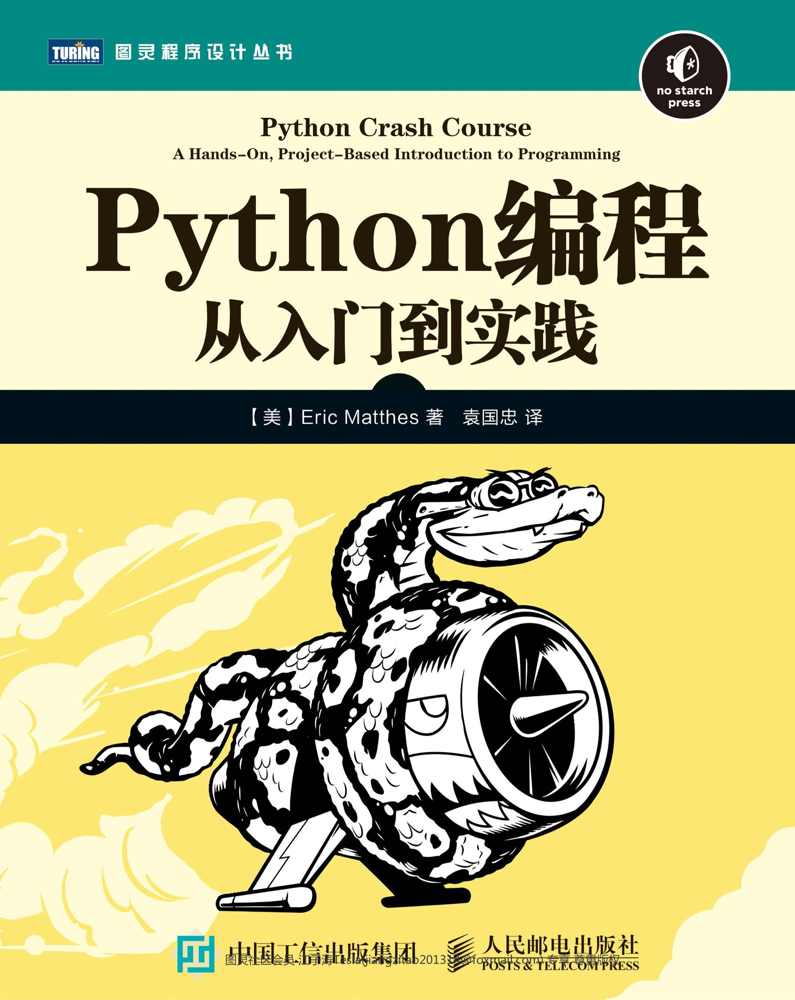

# 第1部分：Python 基础知识

面向零基础或需要系统复盘的同学，从变量、数据结构、控制流到函数与类，循序渐进掌握 Python 的核心语法与编程思想；并通过文件、异常与测试等工程实践串联完整开发流程。

- 变量与基本数据类型
- 列表、字典与集合
- 条件、循环与用户输入
- 函数、模块与包
- 面向对象编程（类与实例）
- 文件读写与异常处理
- 单元测试与调试

---

来源：

《Python编程：从入门到实践》

